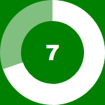

# circleCounterJS
JavaScript Circle Time Counter without dependencies



Add the stylesheet and javascript to your html page:

``` html
<link rel="stylesheet" href="circleCounter.css">
<script src="circleCounter.js"></script>
``` 

Create a div that will contain the counter:

``` html
<div style="width:50px;height:50px;background-color: blue;">
    <div id="myCounter"></div>
</div>
```

The counter will expand to the size of the container. Invoke it with:

``` javascript
circleCounter.start("myCounter", 5, 10);
```

The syntax is:
``` javascript
circleCounter.start( elementName, duration, thickness, callbackFunction );
```
